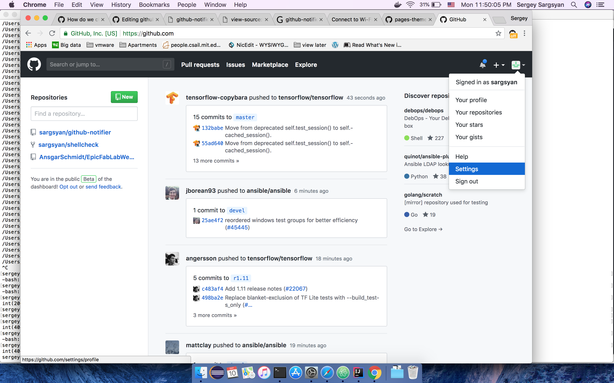

Documentation

## Table of Contents

- [Description](#description)
- [Tips and tricks](#how-to-use)
- [Installing](#installing)
- [Comparison to with other tools and techniques](#comparison-to-with-other-tools-and-techniques)
- [How to generate github notifications token](#how-to-generate-github-notifications-token)
- [Troubleshooting](#troubleshooting)
- [Support](#support)

# Description

The application will show real-time notifications from Github and Github enterprise instances. One of the most important focuses of the application is to provide the most information with the notification banner, so that users would not need to click and open the details in a browser unless they want to participate in the thread. This will allow users to get updated on what is going on in the projects that they are interested without getting interupted from their daily tasks.

# How to generate github notifications token

Click on you user Icon in the top right part for Github website or Github enterprise server, Go to settings.

Go to "Developer settings" page.

Then go to "Personal access tokens" page

and click on "Generate new token"

Enter your password in newly opened login screen.

On successful login Personal access tokens page will be updated with available scopes. Add description for the token, tick on a "notifications" scope and click "Generate token".

You will see the value of the generated token. Copy the value and you have it.

**Note that once you will close the page you cannot fetch the value again.** 

If you didn't configure the value with github notifier you can either generated new token or click on the existing token and push "Regenerate token button". When you regenerate the token make sure that applications and services don't use the old value of the token, because the old will become invalid.

# Comparison to with other tools and techniques

Disclaimer: This is not definitive comparison with all the available tools. The comparison is done with the main popular tools.

## Notifier for GitHub

The Chrome extension supports Github and Github enterprise server. However, you can enable only one Github Enterprise server or github.com account. As is shown in the screenshot the extension shows the repository name, PR/Issue name and why the notifications is shown. After clicking on the extension you will go to the PR/Issue.

## RSS Notifications from github

Users can enable RSS feeds from github.com or Github Enterprise server by clicking to "Subscribe to your news feed" as shown below

Then you can install one of the RSS feed notifier browser extension or a desktop application and get the notification popups

# Support
in case of problems, you can [create an issue](https://github.com/sargsyan/github-notifier/issues) 
